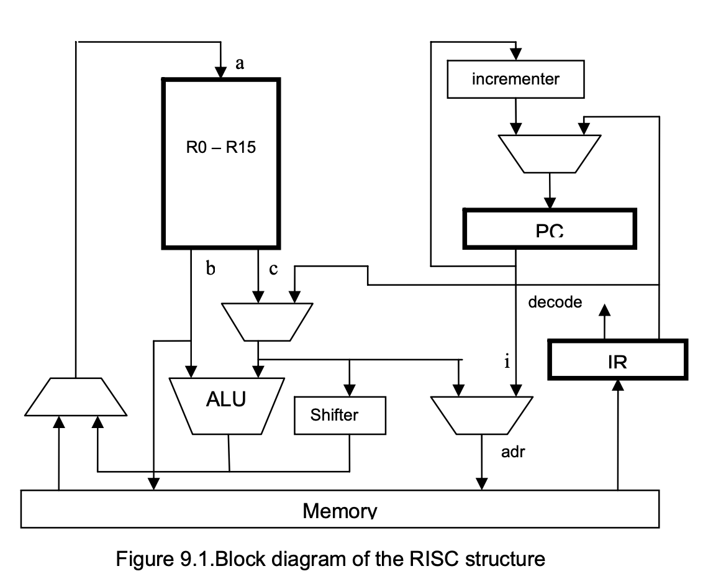

# Implementation of RISC-5

JavaScript implementation of Wirth's RISC-5 CPU simulator. (RISC-0 at this moment because of lack floating-point support)

This is simple 32-bit RISC-like CPU from book "Compiler construction".

Project based on analysis of various open-source projects that implement ProjectOberon system.
